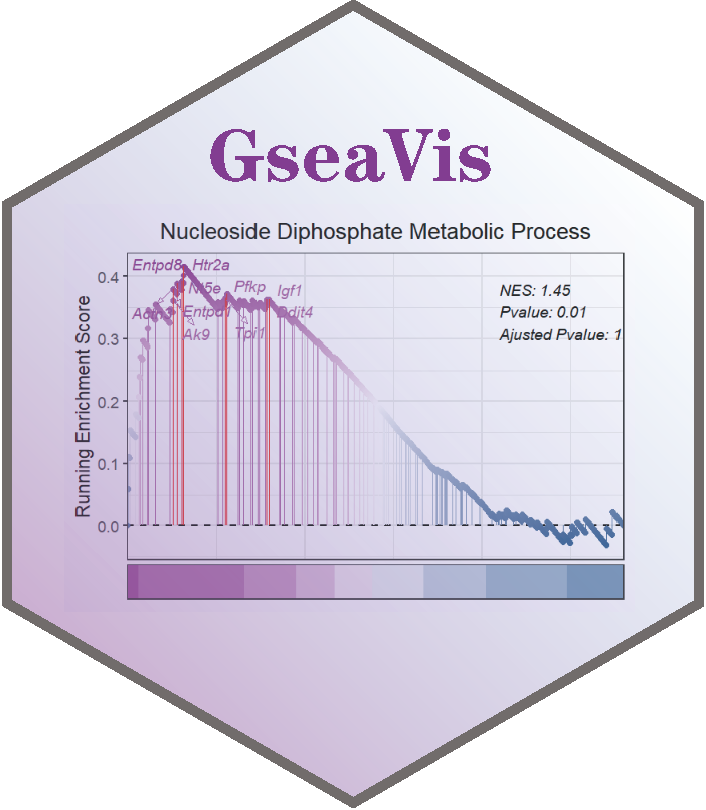

# GseaVis 

<!-- badges: start -->

The goal of GseaVis is to visualize GSEA enrichment results as an implement package for **enrichplot** _gseaplot2_ function. And some codes origin from **enrichplot** package, thanks for **Guangchuang Yu** professor's contribution! The enrichment results from [**clusterProfiler**](https://github.com/YuLab-SMU/clusterProfiler) and [**GSEA software**](http://www.gsea-msigdb.org/gsea/index.jsp) can be supported as input for **GseaVis** for visualization.

You can mark your gene name on GSEA plot and this package also support more avaliable parameters to customize your own plot.

<!-- badges: end -->

## Installation

You can install the development version of GseaVis from [GitHub](https://github.com/) with:

``` r
# install.packages("devtools")
devtools::install_github("junjunlab/GseaVis")
```

## Citation

> Jun Z (2022). *GseaVis: An Implement R Package to Visualize GSEA Results.*  https://github.com/junjunlab/GseaVis, https://github.com/junjunlab/GseaVis/wiki

## Examples


## More examples refer to

> **https://github.com/junjunlab/GseaVis/wiki**

## Related blogs

> - [**GseaVis 优雅的可视化 GSEA 富集结果**](https://mp.weixin.qq.com/s?__biz=MzkyMTI1MTYxNA==&mid=2247501276&idx=1&sn=dce53570ae507affd283ade6bf13e635&chksm=c184ffadf6f376bb877733ac98f1bae3dbe3d1f1e019d9dc044e976dfc0f4197d6df832ea074&token=503374955&lang=zh_CN#rd)
> - [**GseaVis 的一些新功能**](https://mp.weixin.qq.com/s?__biz=MzkyMTI1MTYxNA==&mid=2247503821&idx=1&sn=452994f7744ef4ae9b0a84cfc82be016&chksm=c184f5bcf6f37caa2b30f5994e63ccf451f16e1f9e75db5131bc6004b3d0d91db048a44a0434&token=503374955&lang=zh_CN#rd)
> - [**GseaVis 对 gseKEGG 结果的支持优化**](https://mp.weixin.qq.com/s?__biz=MzkyMTI1MTYxNA==&mid=2247504498&idx=1&sn=9397b6e0ba0142e73df648bb86486003&chksm=c184e803f6f36115ccaf03dc792886a8cc5ea27e7b6c6e78282c022ad57bc73a7ee00d60d0e7&token=503374955&lang=zh_CN#rd)
> - [**R 包 bug 修复及问题一览**](https://mp.weixin.qq.com/s?__biz=MzkyMTI1MTYxNA==&mid=2247506202&idx=1&sn=e0e464ea398b5f53660109dc1bb82ea5&chksm=c184e36bf6f36a7d86509fd6a691c8e421b9143867664f0c18b5b010d558f4f37eccd2992aa9&token=503374955&lang=zh_CN#rd)
> - [**dotplotGsea 可视化 GSEA 富集结果**](https://mp.weixin.qq.com/s?__biz=MzkyMTI1MTYxNA==&mid=2247506271&idx=1&sn=74c8eabda17915d1931bc6fec7e054f2&chksm=c184e32ef6f36a38974b53c7586a00d192753e691be0ce09cfe501e4ea493ec1c2bbfbce25bc&token=503374955&lang=zh_CN#rd)
> - [**GSEA 结果火山图可视化**](https://mp.weixin.qq.com/s?__biz=MzkyMTI1MTYxNA==&mid=2247506419&idx=1&sn=f9ad91a426fc6ef1f6fe7e5ce0343845&chksm=c184e382f6f36a94c5ac6cdd662eb69ef6736d778c64635ada874d6f512f5cd91935047cfd72&token=503374955&lang=zh_CN#rd)
> - [**GseaVis 多条通路可视化**](https://mp.weixin.qq.com/s?__biz=MzkyMTI1MTYxNA==&mid=2247506468&idx=1&sn=784d933d674ebaa7eb47cc02597a8437&chksm=c184e055f6f3694356c618a07299d6215c1a87521bab4553b2b34938ae7799d1bd9927306fa2&token=503374955&lang=zh_CN#rd)
> - [**GseaVis 为你的通路基因添加热图**](https://mp.weixin.qq.com/s?__biz=MzkyMTI1MTYxNA==&mid=2247506582&idx=1&sn=24994c3eb73d5c30d5c56ae4894151a6&chksm=c184e0e7f6f369f151009e47e59a0ddbb7727dcd4dce8503f8fe861f1cf08103439b791a3eec&token=503374955&lang=zh_CN#rd)
> - [**bugs 报告和修复**](https://mp.weixin.qq.com/s?__biz=MzkyMTI1MTYxNA==&mid=2247507735&idx=1&sn=d8236c12a07beecc5d6c181b196a9a78&chksm=c184e566f6f36c7072f382be27259127b4fa9c0b1228c891f5cfc35869861b3d9b8f6e9b0824&token=139164705&lang=zh_CN#rd)
> - [**同学你又在画 GSEA?**](https://mp.weixin.qq.com/s?__biz=MzkyMTI1MTYxNA==&mid=2247507943&idx=1&sn=2dc950650892f93a53eb1ef9abab6555&chksm=c184e596f6f36c8073acb3b614897062249c9b51c3aff4657dc9156670a9ff7a99df78dc7787&token=495330596&lang=zh_CN#rd)
> - [**GseaVis 一键对接 GSEA 软件结果并可视化**](https://mp.weixin.qq.com/s?__biz=MzkyMTI1MTYxNA==&mid=2247508126&idx=1&sn=99fb4220166f8865762a6c2eb495ebe4&chksm=c1849aeff6f313f98b412186a5139e72ebb147f1899c00e7919899be6849f604667d987a1090&token=1432898004&lang=zh_CN#rd)
